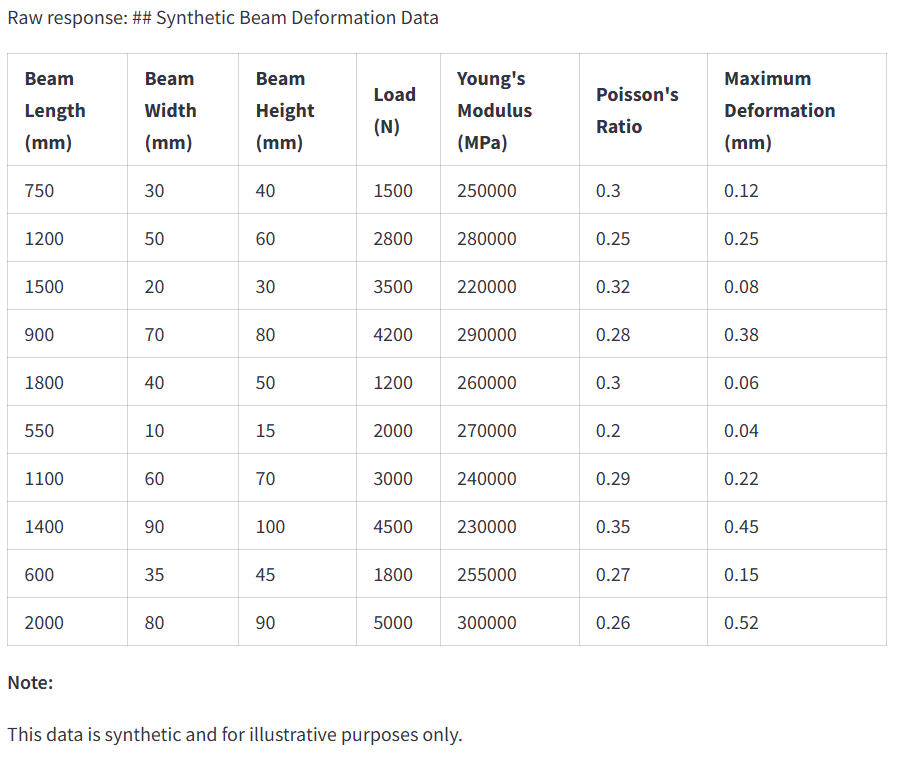

# Synthetic Dataset for Structural Deformation Analysis
## Project Overview
The Structural Deformation Data Generator is a synthetic data generation tool that simulates structural deformation scenarios for beams under various loading conditions. Using AI models from Groq and LangChain, this application generates data on beam dimensions, material properties, applied load, and resulting deformation. The generated data can be used to train or test machine learning models in engineering applications, such as structural analysis or material strength prediction.

## Background:
In engineering, structural deformation is a critical factor in determining the durability and stability of materials under load. However, real-world testing data is often limited and costly to obtain. Synthetic data generation offers a cost-effective alternative for creating large datasets for training machine learning models. This project leverages AI to simulate deformation under specified conditions, making it easier to develop models that can predict material behavior in various scenarios.

## Objectives:
+ **Generate Synthetic Data**: Simulate data for beam deformation under different load conditions using specified ranges for beam dimensions, material properties, and load values.
+ **Provide Interactive Interface**: Use Streamlit to create an intuitive UI that allows users to input configuration parameters and generate data easily.
+ **Output in CSV Format**: Enable users to download the generated synthetic dataset as a CSV file for easy integration with other tools and platforms.
+ **Demonstrate AI-based Simulation**: Show how AI models like Groq's can be leveraged with LangChain to create synthetic datasets for engineering applications.

## Tech Stack:
+ **Streamlit**: For front-end UI and user interaction.
+ **LangChain**: For chain creation, including document retrieval and language model invocation.
+ **Groq API**: For leveraging Llama-based large language models. 
+ **dotenv**: To manage API keys and sensitive data securely.

## Installation & Setup:
### Prerequisites:
+ Python 3.8 or above
+ Streamlit
+ LangChain
+ Groq API Key
+ dotenv

### Instructions:
+ Clone the Repository:
    Inline `code`
    git clone https://github.com/surajsahubigdata/Synthetic-Dataset-for-Structural-Deformation-Analysis.git

+ Create virtual environment and install the required packages:
    Inline `code`
    conda create -p venv python==3.10
    pip install -r requirements.txt

+ Create a .env file in the project root directory and add your API keys:
    Inline `code`
    GROQ_API_KEY=your_groq_api_key

+ Run the app:
    Inline `code` streamlit run app.py

## Usage:
+ **Input Beam and Load Parameters**:
Enter values for beam length, width, height, load, Young’s modulus, and Poisson’s ratio. The app provides default ranges for each parameter.
+ **Generate Data**:
Click the “Generate Data” button to create a synthetic dataset based on your inputs.
The data will be displayed in a table format within the app.
+ **Download CSV**:
After data generation, you can download the dataset as a CSV file for further analysis or integration into other applications.

## Output:

## Future Enhancements:
+ **Add Additional Material Types**: Expand the material options beyond standard beam properties to include other materials.
+ **Customizable Data Ranges**: Allow users to set custom ranges for material and load values.
+ **Integration with Simulation Software**: Enable export to formats compatible with engineering simulation tools.

## Contributing:
Contributions to improve and expand this tool are welcome! Please submit a pull request or open an issue for any enhancements or bug fixes.